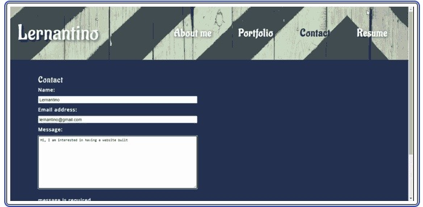

# React Portfolio

## User Story

 

AS AN employer looking for candidates with experience building single-page applications
I WANT to view a potential employee's deployed React portfolio of work samples
SO THAT I can assess whether they're a good candidate for an open position

# Acceptance Criteria

GIVEN a single-page application portfolio for a web developer
 

<ul>
<li>WHEN I load the portfolio</li>
<li>THEN I am presented with a page containing a header, a section for content, and a footer</li>
<li>WHEN I view the header</li>
<li>THEN I am presented with the developer's name and navigation with titles corresponding to different sections of the portfolio</li>
<li>WHEN I view the navigation titles</li>
<li>THEN I am presented with the titles About Me, Portfolio, Contact, and Resume, and the title corresponding to the current section is highlighted</li>
<li>WHEN I click on a navigation title</li>
<li>THEN I am presented with the corresponding section below the navigation without the page reloading and that title is highlighted</li>
<li>WHEN I load the portfolio the first time</li>
<li>THEN the About Me title and section are selected by default</li>
<li>WHEN I am presented with the About Me section</li>
<li>THEN I see a recent photo or avatar of the developer and a short bio about them</li>
<li>WHEN I am presented with the Portfolio section</li>
<li>THEN I see titled images of six of the developer’s applications with links to both the deployed applications and the corresponding GitHub repository</li>
<li>WHEN I am presented with the Contact section</li>
<li>THEN I see a contact form with fields for a name, an email address, and a message</li>
<li>WHEN I move my cursor out of one of the form fields without entering text</li>
<li>THEN I receive a notification that this field is required</li>
<li>WHEN I enter text into the email address field</li>
<li>THEN I receive a notification if I have entered an invalid email address</li>
<li>WHEN I am presented with the Resume section</li>
<li>THEN I see a link to a downloadable resume and a list of the developer’s proficiencies</li>
<li>WHEN I view the footer</li>
<li>THEN I am presented with text or icon links to the developer’s GitHub and LinkedIn profiles, and their profile on a third platform (Stack Overflow, Twitter)</li>
</ul>

[Link to Portfolio](https://placeholder)

Contribution guidelines for this project
 

